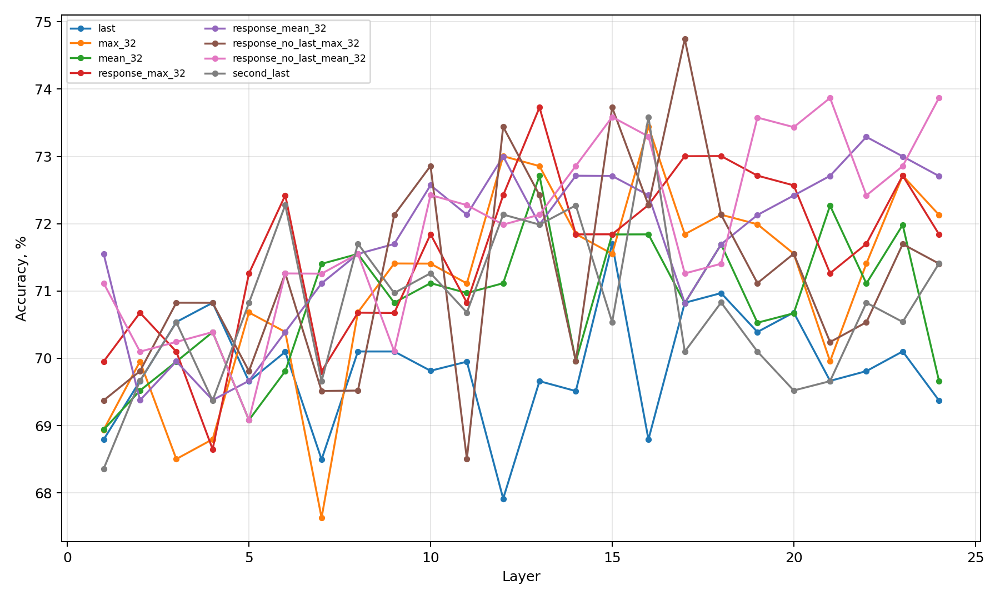
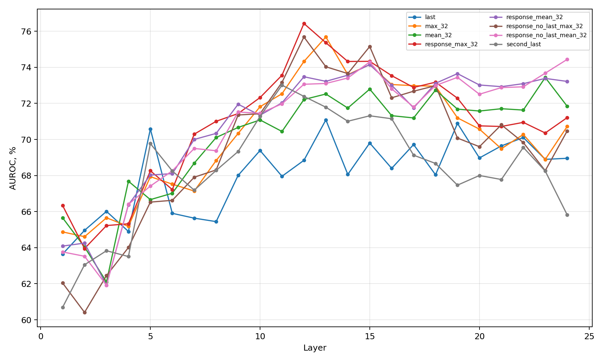
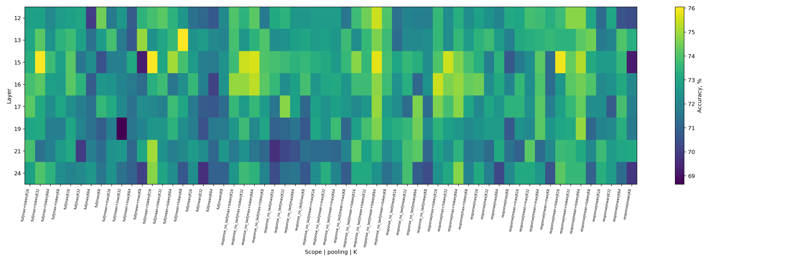
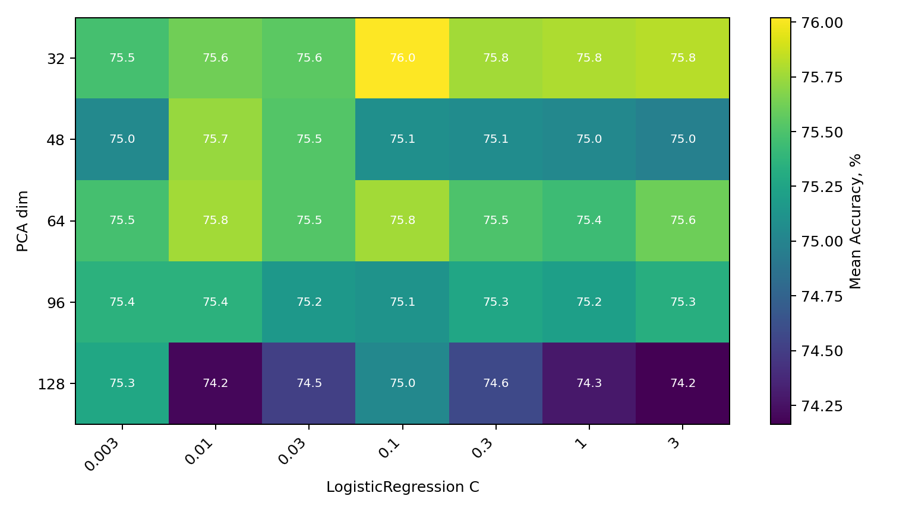

# SMILES-2026 Hallucination Detection — Solution Report


Small dataset made it possible to run exhaustive grid search experiments, which I fully used in this project. I used Accuracy as a primary metric and achieved 76.14% as a mean result across 5 random seeds on 5-fold CV. In the final project repository I modified only three files allowed by the task. 

### Reproducibility instructions
To reproduce the solution:
```
pip install -r requirements.txt
python solution.py
```

## Literature Motivation

I found related works about hallucination detection and used them to formulate hypotheses:
- [The Internal State of an LLM Knows When It's Lying](https://arxiv.org/abs/2304.13734)
- [LLMs Know More Than They Show](https://arxiv.org/abs/2410.02707)
- [INSIDE: LLMs' Internal States Retain the Power of Hallucination Detection](https://arxiv.org/abs/2402.03744) 

The truthfulness signal can be found in hidden layers and unevenly distributed across layers. Informative positions do not have to match the last token of the final layer. This motivates using features from hidden states and layer-wise and token-wise probing.

## Base model choice 
Since most hypotheses and ideas revolve around feature engineering, I needed to fix a base model to enable fair selection. I considered MLP too high-variance for the small dataset and instead opted for a regularized linear model. This was not assumed to be the final model. It was used as a stable measuring tool for comparing feature configurations.

`StandardScaler -> PCA(64) -> LogisticRegression(class_weight='balanced', C=1.0)`

Additionally, I switched threshold tuning from F1 to the Accuracy metric, which gave me a performance gain. I made a small hyperparameter sweep (PCA dim and C) to be sure with the best choice. To improve reliability and stability, and given the small dataset size, I used 5-fold cross-validation on each model evaluation.   

# Journey 

## Experiment 1: Layer selection

The first experiment is for searching best layer and token views (features). For each of 24 transformer layers I evaluated 10 token views: 
- single token: `last`, `second_last`
- suffix: `mean(last32)`, `max(last_32)`, `mean(last_32) + last_token`
- response aware: `response_mean_32`, `response_max_32`, `response_no_last_mean_32`, `response_no_last_max_32`






Top best layer-feature configurations by Accuracy:

| Layer | Faeture | Accuracy | AUROC | Std Acc |
|---:|---|---:|---:|---:|
| 17 | `response_no_last_max_32` | 74.75% | 72.67% | 1.62% |
| 24 | `response_no_last_mean_32` | 73.87% | 74.44% | 3.75% |
| 21 | `response_no_last_mean_32` | 73.87% | 72.88% | 2.38% |
| 15 | `response_no_last_max_32` | 73.73% | 75.15% | 1.35% |
| 13 | `response_max_32` | 73.73% | 75.36% | 1.83% |
| 16 | `second_last` | 73.59% | 71.15% | 0.73% |
| 19 | `response_no_last_mean_32` | 73.58% | 73.44% | 3.30% |
| 12 | `response_no_last_max_32` | 73.44% | 75.68% | 1.74% |


## Experiment 2: Features selection

After layer selection experiment I fixed top-8 the strongest layers (17, 24, 21, 15, 13, 16, 19, 12) and ran a wider token pooling sweep. I varied:

- 3 token scopes: `full`, `response`, `response_no_last`
- 5 poolings: `mean`, `max`, `mean + max`, `mean + token`, `max + token` (token = [`last`, `second_last`])
- 4 tail lengths: 8, 16, 32, 64

In total this gave 8 * 3 * 7 * 4 = 672 configurations. 



Best configurations by accuracy:

| Config | Accuracy | AUROC | Std Acc |
|---|---:|---:|---:|
| `L13_full_mean_8_plus_second_last` | 76.05% | 72.00% | 2.08% |
| `L15_full_mean_16_plus_second_last` | 76.05% | 74.13% | 2.14% |
| `L15_full_max_32_plus_second_last` | 76.05% | 75.32% | 2.50% |
| `L15_response_mean_16_plus_second_last` | 75.90% | 74.69% | 2.70% |
| `L15_response_no_last_mean_64_plus_second_last` | 75.76% | 77.92% | 2.70% |

The best Accuracy improved from `74.75%` in previous experiment to `76.05%`. The most important pattern was branch concatenation `tail pooling + token`. This motivates to explore feature and layer combinations. 

## Experiment 3: Multi Layer combination

In this experiment I tried combining features from strong layers into one vector by concateneting or avereging. I ran 
252 configurations on default seed `42` and got a small gain to accuracy, which was not confirmed when repeated with seed `43`. Best `42` accuracy — `76.34%`, best `43` accuracy - `75.03%`. Single layer candidates gave more stability. I decided not to use multi layer feature concatenation as the final path.


## Experiment 4: Ensemble 

The problem of previous experiment was using only one model and same PCA space for different features. I decided to try ensemble where each feature view gets its own independent base model and probabilities predections are averaged. 

By comparing configurations of different best complient features from experiment 2 I chose response-aware ensemble: `L12_response_max_16_plus_last`, `L19_response_mean_64_plus_last`, `L15_response_no_last_mean_64_plus_last`.

As one of our goals is stability, I ran 5 seed test and decided to compare models by mean and minimum accuracy. Chosen ensemble outperformed the best fixed single view:

| Model | Mean Acc | Min Acc | Mean AUROC |
|---|---:|---:|---:|
| Best fixed single | 75.25% | 75.18% | 75.31% |
| Response-aware ensemble | 75.69% | 75.32% | 77.70% |

I also compared `last` and `second_last`. Although `second_last` was strong in single-view sweeps, the final ensemble with `plus_last` was more stable:

| Ensemble | Mean Acc | Min Acc | Mean AUROC |
|---|---:|---:|---:|
| `plus_last` | 75.44% | 75.18% | 77.45% |
| `plus_second_last` | 74.80% | 74.01% | 76.91% |


## Ablation Study

Finally I ran ablations on final response-aware ensemble to check if model choice was right (LogReg better than MLP), tune hyperparameters (PCA, C) and test adding geometry features. All 61 configurations were run 5 times on different random seeds (42, 43, 1329, 57, 179) to check stability. 

Best results by groups:

| Model | Mean Acc | Min Acc | Mean AUROC | Conclusion |
|---|---:|---:|---:|---|
| Current LogReg ensemble, `PCA64/C1` | 75.44% | 75.18% | 77.45% | Strong and stable baseline |
| Tuned LR, `PCA32/C0.1` | 76.02% | 75.04% | 77.72% | Better mean Accuracy |
| Ridge ensemble | 75.33% | 74.16% | 77.61% | Good AUROC, weaker Accuracy |
| MLP ensemble | 74.43% | 72.70% | 76.16% | Worse and less stable |
| Single MLP on concatenated features | 72.34% | 69.38% | 72.53% | Clear overfitting/instability |
| Geometry-only LR | 72.11% | 70.98% | 74.06% | Not enough alone |
| LR ensemble + geometry LR | 75.73% | 75.04% | 77.95% | Lower Accuracy than geometry Ridge |
| LR ensemble + geometry Ridge | 76.14% | 75.18% | 77.79% | Best overall candidate |

This confirmed that the original linear-model choice was correct. MLP did not improve results and had much worse worst-seed behavior.



For final features the best hyperparametrs are more compact projection `PCA=32` and stronger L2 regularization `C=0.1`. 

Member ablation showed that all members of ensemble are important. Adding extra response branches (?) features did not impove final accuracy. 

The most useful new feature was adding geometry. I used statistics from layers 12, 15, 19: vector norms, layers mean/std/max/min, cosine/distance between layers and between token and tails. Geometry alone was weak. It improved Accuracy as a fourth Ridge member in ensemble.

## Final Decision

The final model was chosen as the best candidate from experiments, achieving the best mean Accuracy of **76.14%** on 5 random seeds and 5-fold CV (as all previous evaluations). Moreover, it preserved a strong worst seed results **75.18%**.

Final model structure:

| Member | Model | Feature |
|---|---|---|
| 1 | `Scaler -> PCA(64) -> LogisticRegression(C=1.0)` | `L12_response_max_16_plus_last` |
| 2 | `Scaler -> PCA(64) -> LogisticRegression(C=1.0)` | `L19_response_mean_64_plus_last` |
| 3 | `Scaler -> PCA(64) -> LogisticRegression(C=1.0)` | `L15_response_no_last_mean_64_plus_last` |
| 4 | `Scaler -> PCA(16) -> Ridge(alpha=100)` | geometry features |


In the final repository only the allowed files were changed:
- `aggregation.py` - extracts response-aware and geometry features
- `probe.py` - trains LogReg and Ridge members with threshold tuned by the Accuracy metric
- `splitting.py` - stratified 5-fold cross validation from base model 


